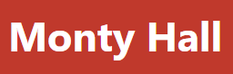
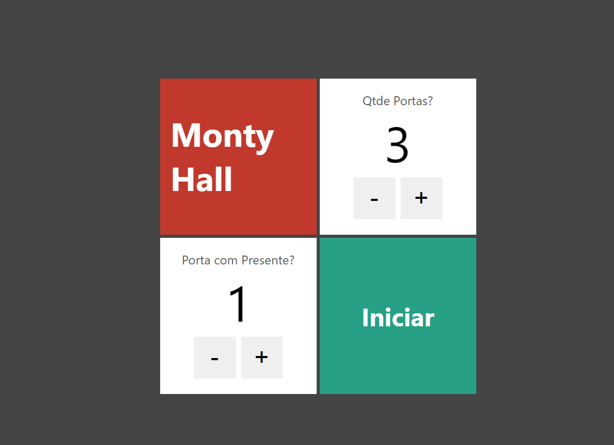
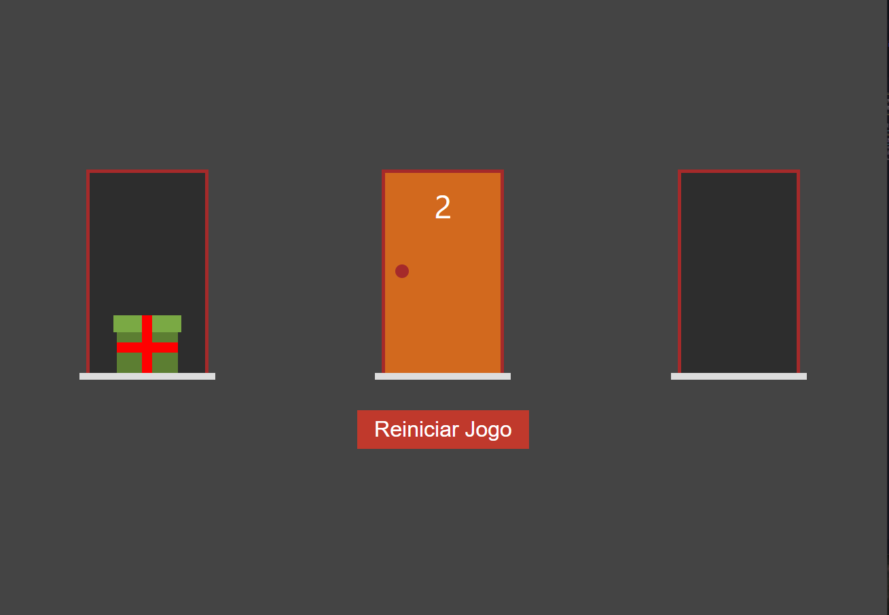

  

Jogo das Portas desenvolvido em **Nextjs** com **TypeScript** inteiramente componentizado com **componentes puros**.

  
Curso Udemy - Next.js e React: Desenvolvendo um jogo 

  
Instrutor - Leonardo Moura Leitao

  

### Layout do projeto

Tela Principal

  

Tela do Jogo

  

  <small>Sandro - 2021</small>

